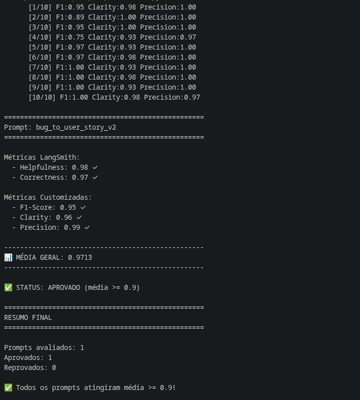

# Desafio MBA IA - Pull, Otimização e Avaliação de Prompts

Este repositório contém a solução técnica para o desafio de Engenharia de Prompts. O objetivo é realizar o pull de um prompt de baixa qualidade do LangSmith, refatorá-lo utilizando técnicas avançadas para conversão de relatos de bugs em *User Stories*, submeter (push) a nova versão e avaliá-la garantindo pontuação mínima de 0.9 nas métricas estabelecidas.

[Documentação Original do Desafio](desafio.md)

---

## Resultados Finais

O pipeline de avaliação demonstrou um desempenho superior à meta estabelecida (score >= 0.90) em todos os critérios exigidos. A versão final do prompt (`v2`), processada pelo modelo **Gemini 3 Flash Preview**, atingiu notas próximas à perfeição.

🔗 [bug_to_user_story_v2](https://smith.langchain.com/hub/nads/bug_to_user_story_v2)

### Tabela Comparativa: Prompt Ruim (v1) vs. Prompt Otimizado (v2)

| Métrica                      |       V1 (Gemini 2.5)       |       V2 (Gemini 2.5)       |        V2 (Gemini 3)        |
| :---------------------------- | :--------------------------: | :-------------------------: | :-------------------------: |
| **Tone Score**          |             0.98✅            |            0.94✅           |            0.99✅           |
| **Acceptance Criteria** |           0.88 ❌           |           0.95 ✅           |           1.00 ✅           |
| **User Story Format**   |           0.91 ✅           |           0.95 ✅           |           1.00 ✅           |
| **Completeness**        |           0.71 ❌           |           0.98 ✅           |           0.99 ✅           |
| **Média Geral**        | **0.8703 (Reprovado)** | **0.9560 (Aprovado)** | **0.9941 (Aprovado)** |

### Evidências de Execução (Screenshots)

**1. Avaliação Inicial (Prompt V1 reprovado no LangSmith):**


**2. Avaliação Otimizada (Prompt V2 aprovado com Gemini 2.5):**


**3. Avaliação Final (Prompt V2 aprovado com Gemini 3 Flash):**


---

## Comparativo de Desempenho e Evolução dos Testes

O processo de otimização foi estruturado em etapas para avaliar o impacto isolado da reestruturação do prompt e da atualização do modelo. Os resultados encontram-se consolidados na tabela a seguir:

| Métrica                      |       V1 (Gemini 2.5)       |       V2 (Gemini 2.5)       |        V2 (Gemini 3)        |
| :---------------------------- | :--------------------------: | :-------------------------: | :-------------------------: |
| **Tone Score**          |            0.98✅            |           0.94✅           |           0.99✅           |
| **Acceptance Criteria** |           0.88 ❌           |           0.95 ✅           |           1.00 ✅           |
| **User Story Format**   |           0.91 ✅           |           0.95 ✅           |           1.00 ✅           |
| **Completeness**        |           0.71 ❌           |           0.98 ✅           |           0.99 ✅           |
| **Média Geral**        | **0.8703 (Reprovado)** | **0.9560 (Aprovado)** | **0.9941 (Aprovado)** |

### 1. Impacto da Engenharia de Prompt (V1 vs. V2 com Gemini 2.5)

Na validação do prompt inicial (V1), o modelo apresentou falhas na métrica de *Completeness* (0.71) por omitir especificações do relato original, e não atingiu a pontuação mínima exigida na formatação dos *Critérios de Aceitação* (0.88), acarretando a reprovação do teste.

Na revisão (V2), mantendo o modelo Gemini 2.5, incorporou-se a aplicação das técnicas de *Role Prompting*, *Chain of Thought* e *Few-Shot*. A reestruturação das instruções mitigou as omissões, elevando a completude para 0.98 e aprovando a execução com média 0.9560. Os resultados demonstram que a organização formal do contexto afeta diretamente a extração correta de informações.

### 2. Impacto da Atualização do Modelo (Gemini 2.5 vs. Gemini 3)

Com o prompt V2 já validado, o motor de inferência foi atualizado para o **Gemini 3** visando analisar a estabilidade da saída sintática.

O teste indicou uma aderência superior às restrições de formatação: a execução obteve pontuação máxima (1.00) nas métricas de formato e critérios de aceitação, estabelecendo uma média final de **0.9941**. Observa-se que a utilização de um modelo mais recente, aliada ao prompt estruturado, reduz a flutuação nas respostas geradas.

### Avaliações Complementares (Métricas LangSmith)

A execução com o Gemini 3 Flash Preview também foi submetida aos critérios estendidos do LangSmith, resultando nos seguintes indicadores de performance:

| Métrica LangSmith    | Pontuação Final |  Status  |
| :-------------------- | :---------------: | :------: |
| **Helpfulness** |       0.98       | Aprovado |
| **Correctness** |       0.97       | Aprovado |
| **F1-Score**    |       0.95       | Aprovado |
| **Clarity**     |       0.96       | Aprovado |
| **Precision**   |       0.99       | Aprovado |



---

## Técnicas Aplicadas (Fase 2)

Para a otimização do arquivo `prompts/bug_to_user_story_v2.yml`, foram selecionadas três técnicas fundamentais de Engenharia de Prompt para maximizar a precisão sintática e a extração de contexto:

### 1. Role-Based Prompting (Persona)

* **Justificativa:** Força o LLM a abandonar respostas genéricas e adotar um viés analítico e vocabulário estritamente técnico, essencial para elevar o *Tone Score*.
* **Exemplo Prático (Trecho do Prompt):**
  > "Você é um Senior Product Manager e QA Engineer especialista em metodologias Ágeis e escrita de requisitos técnicos de alta qualidade. Sua missão é transformar relatos de bugs..."
  >

### 2. Chain of Thought - CoT (Cadeia de Pensamento)

* **Justificativa:** Instruir o modelo a pensar passo a passo organiza o raciocínio interno antes da formatação final. Ao exigir a análise do impacto antes da criação da User Story, mitigamos as omissões de dados, o que garantiu a nota 0.98 em *Completeness*.
* **Exemplo Prático (Trecho do Prompt):**
  > "1. Analise antes de escrever (CoT): Identifique quem é o usuário afetado, qual o impacto no negócio, o contexto técnico relevante e o comportamento esperado vs. atual."
  >

### 3. Few-Shot Learning

* **Justificativa:** O LLM obedece melhor a padrões de formatação (como BDD) quando recebe exemplos concretos. Fornecer pares de Entrada/Saída calibra o modelo para a sintaxe exata exigida, cravando as notas de *User Story Format* e *Acceptance Criteria*.
* **Exemplo Prático (Trecho do Prompt):**
  > "EXEMPLO DE REFERÊNCIA (Few-shot)
  > Entrada (Bug): 'O app crasha quando tento subir foto de perfil de 10MB no Android.'
  > Saída:
  >
  > ### Análise de Impacto [...]
  >
  > ### User Story [...]
  >
  > ### Critérios de Aceitação [...]"
  >

---

## Como Executar

### Pré-requisitos e Dependências

* Python 3.9 ou superior (recomendado 3.12+).
* Contas ativas e chaves de API geradas no [LangSmith](https://smith.langchain.com/) e [Google AI Studio](https://aistudio.google.com/).

### Setup do Ambiente

1. Clone o repositorio e ative um ambiente virtual local:
   ```bash
   python3.12 -m venv venv
   source venv/bin/activate  # No Windows: venv\Scripts\activate
   ```
2. Instale as dependencias requeridas:
   ```bash
   pip install -r requirements.txt
   ```
3. Configure as variaveis de ambiente no arquivo `.env`:
   ```env
   GOOGLE_API_KEY="sua_chave_de_api"
   LANGCHAIN_API_KEY="sua_chave_de_api"
   LANGCHAIN_PROJECT="prompt-optimization-challenge"
   ```
4. Submeta a versao atualizada do prompt para o repositorio do LangSmith:
   ```bash
   python src/push_prompts.py
   ```
5. Execute a a aplicacao de avaliação para validar as metricas:
   ```bash
   python src/evaluate.py
   ```
