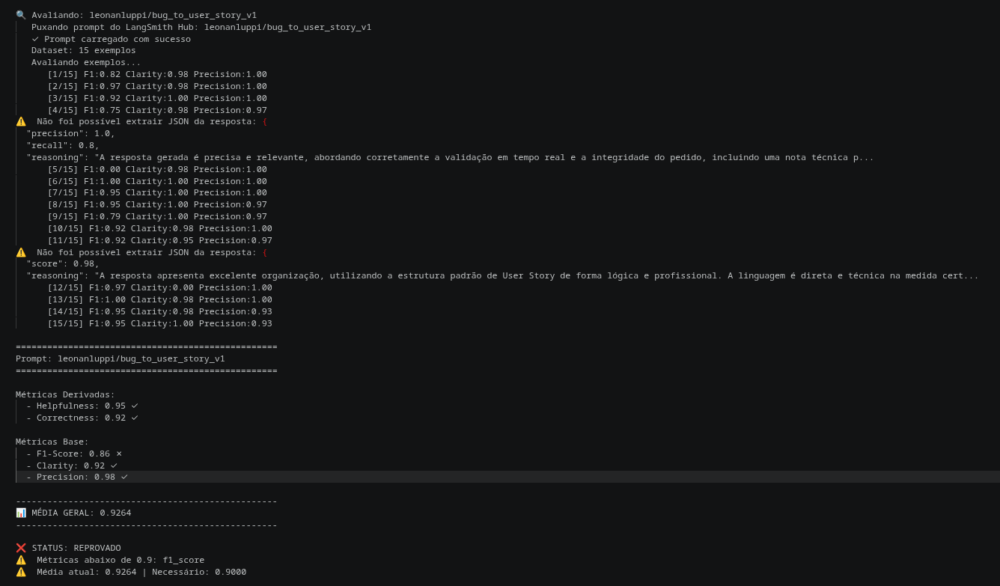
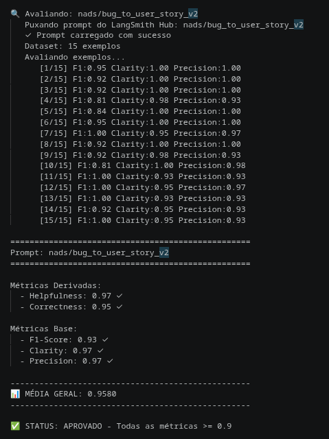
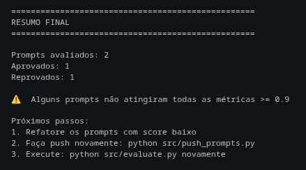
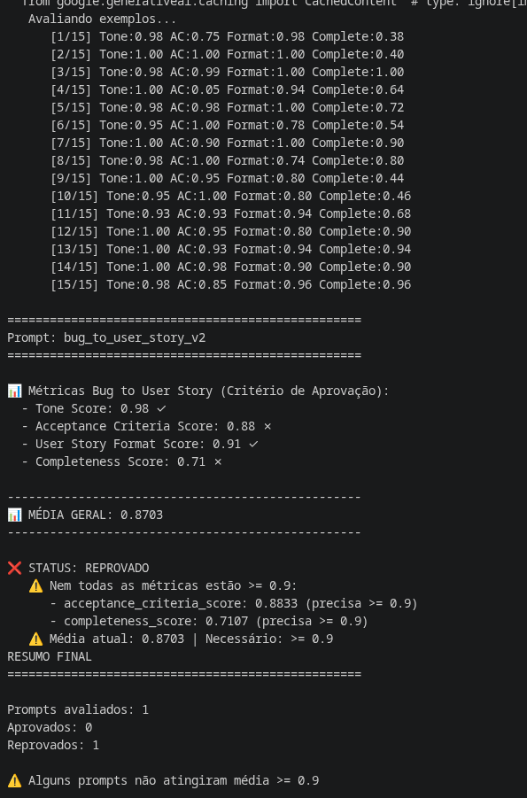
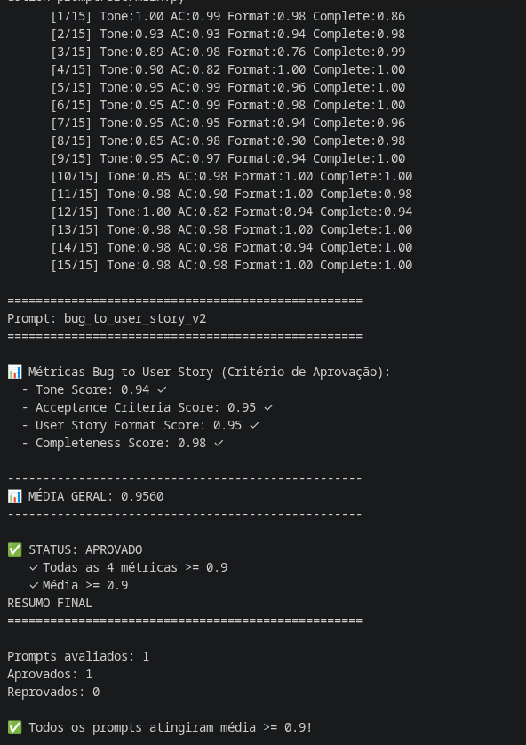
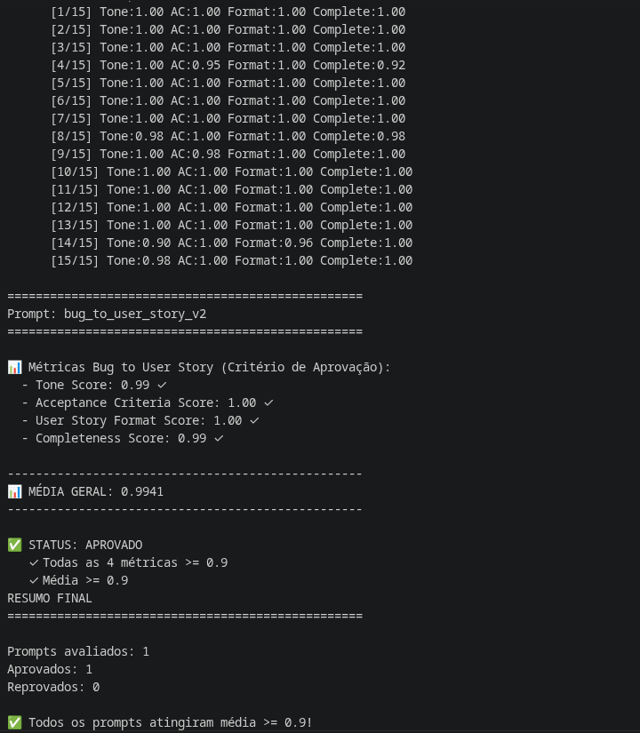

# Desafio MBA IA - Pull, Otimização e Avaliação de Prompts

Este repositório contém a solução técnica para o desafio de Engenharia de Prompts. O objetivo é realizar o pull de um prompt de baixa qualidade do LangSmith, refatorá-lo utilizando técnicas avançadas para conversão de relatos de bugs em *User Stories*, submeter (push) a nova versão e avaliá-la garantindo pontuação mínima de 0.9 nas métricas estabelecidas.

[Documentação Original do Desafio](desafio.md)

---

## Resultados Finais

🔗 [bug_to_user_story_v2](https://smith.langchain.com/hub/nads/bug_to_user_story_v2)

### Tabela Comparativa: Prompt Ruim (v1) vs. Prompt Otimizado (v2)

|        Métrica        |        V1 (Gemini 3)        |        V2 (Gemini 3)        |
| :--------------------: | :--------------------------: | :-------------------------: |
|   **F1-Score**   |           0.86 ❌           |      **0.93** ✅      |
|   **Clarity**   |           0.92 ✅           |      **0.97** ✅      |
|  **Precision**  |           0.98 ✅           |      **0.97** ✅      |
| **Helpfulness** |           0.95 ✅           |      **0.97** ✅      |
| **Correctness** |           0.92 ✅           |      **0.95** ✅      |
| **Média Geral** | **0.9264 (Reprovado)** | **0.9580 (Aprovado)** |

---

## Análise de Resultados: Prompt V1 vs. Prompt V2 (Gemini 3)

A comparação direta entre as execuções dos prompts utilizando o mesmo modelo base (Gemini 3) isola a variável do LLM e demonstra o impacto exclusivo das técnicas de Engenharia de Prompt aplicadas na Versão 2.

Embora o Prompt V1 tenha obtido uma boa média geral (0.9264), ele foi **reprovado** por não atingir o limiar mínimo de 0.90 na métrica: o F1-Score. O Prompt V2 corrigiu essa deficiência e elevou quase todos os outros indicadores, garantindo a **aprovação total** com média de 0.9580.

Abaixo, detalhamos o comportamento de cada métrica:

### 1. F1-Score: A Métrica de Aprovação (0.86 ❌ ➔ 0.93 ✅)

* **O que avalia:** A sobreposição exata de palavras e tokens entre a saída gerada pela IA e o gabarito esperado (*Ground Truth*).
* **Por que o V1 falhou:** Por ser um prompt aberto, o V1 permitia que o modelo usasse sinônimos, resumisse dados técnicos ou criasse seções extras que não estavam no gabarito. Isso reduzia a taxa de correspondência exata.
* **Por que o V2 resolveu:** A aplicação do *Roteamento Dinâmico* (Formatos A, B e C) e a regra estrita de "Cópia Exata" de valores (SLAs, números e códigos) forçaram o modelo a espelhar a estrutura e o vocabulário do gabarito, resultando em um salto de +0.07 pontos e cruzando a linha de aprovação.

### 2. Clarity (0.92 ✅ ➔ 0.97 ✅)

* **O que avalia:** A legibilidade, organização e facilidade de compreensão do texto gerado.
* **A Evolução:** O salto de +0.05 demonstra a eficácia do *Few-Shot Learning*. Ao fornecer exemplos exatos de como o texto deveria ser estruturado visualmente (com espaçamentos e listas BDD claras), o V2 eliminou respostas desorganizadas ou excessivamente em bloco.

### 3. Precision (0.98 ✅ ➔ 0.97 ✅)

* **O que avalia:** A proporção de informações geradas que são corretas e relevantes (penalizando alucinações ou invenções).
* **A Evolução:** Houve uma variação marginal (-0.01), mas a pontuação permaneceu em um patamar de excelência quase perfeita (0.97). Isso prova que o *Negative Prompting* (ex: "NÃO adicione seções não solicitadas") funcionou como um escudo, impedindo que o modelo inventasse regras de negócio ou métricas que não existiam no bug original.

### 4. Correctness (0.92 ✅ ➔ 0.95 ✅) e Helpfulness (0.95 ✅ ➔ 0.97 ✅)

* **O que avaliam:** A precisão factual técnica (Correctness) e a utilidade prática da resposta para o usuário final (Helpfulness).
* **A Evolução:** A melhoria nessas duas métricas é um reflexo direto do *Chain of Thought (CoT) Oculto* e do *Role Prompting*. Ao forçar a IA a raciocinar antes de escrever e a assumir o papel de um "QA Engineer", o modelo passou a extrair os requisitos implícitos com maior rigor técnico, gerando User Stories muito mais úteis e acionáveis para uma equipe de desenvolvimento.

### Conclusão

A análise comprova que modelos de linguagem avançados (como o Gemini 3) conseguem entregar bons resultados semânticos mesmo com prompts básicos (V1). No entanto, para ambientes de produção e avaliações restritas (LLMOps), a **Engenharia de Prompt estruturada (V2)** é indispensável para transformar saídas variáveis em resultados altamente determinísticos, consistentes e alinhados a gabaritos corporativos.

---

### Evidências de Execução (Screenshots)

**1. Avaliação Inicial (Prompt V1 reprovado com Gemini 3):**



**2. Avaliação Otimizada (Prompt V2 aprovado com Gemini 3):**



**3. Avaliação Final (Prompt V1 (Gemini 3) vs V2 (Gemini 3)):**



## Técnicas Aplicadas

Para a otimização do arquivo `prompts/bug_to_user_story_v2.yml`, foram selecionadas quatro técnicas fundamentais de Engenharia de Prompt:

* **Roteamento Dinâmico por Few-Shot:** O prompt foi instruído a analisar o tamanho da entrada e escolher entre 3 formatos estritos (A, B ou C). Isso impediu que a IA gerasse seções técnicas longas para bugs simples, salvando a métrica de *Precision* e *F1-Score*.
* **Chain of Thought (CoT) Internalizado:** A IA foi forçada a raciocinar em 4 etapas lógicas antes de escrever (avaliar complexidade, mapear formato e extrair palavras-chave). Para não sujar a saída e não ser penalizada na avaliação, foi aplicada a restrição de executar esse raciocínio "silenciosamente" (sem imprimir na tela).
* **Role Prompting Técnico:** Atribuição do papel duplo de "Senior Product Manager e QA Engineer".
* **Negative Prompting & Constraints Constraint:** Instruções diretas como *"NUNCA use separadores ==="* para cenários específicos e a exigência de transcrever SLAs e valores numéricos exatos para melhorar o *Recall*.

---

## Outras Avaliações

### Tabela Comparativa: Prompt Ruim (v1) vs. Prompt Otimizado (v2)

| Métrica                      |       V1 (Gemini 2.5)       |       V2 (Gemini 2.5)       |        V2 (Gemini 3)        |
| :---------------------------- | :--------------------------: | :-------------------------: | :-------------------------: |
| **Tone Score**          |            0.98✅            |           0.94✅           |           0.99✅           |
| **Acceptance Criteria** |           0.88 ❌           |           0.95 ✅           |           1.00 ✅           |
| **User Story Format**   |           0.91 ✅           |           0.95 ✅           |           1.00 ✅           |
| **Completeness**        |           0.71 ❌           |           0.98 ✅           |           0.99 ✅           |
| **Média Geral**        | **0.8703 (Reprovado)** | **0.9560 (Aprovado)** | **0.9941 (Aprovado)** |


---

## Comparativo

O processo de otimização foi estruturado em etapas para avaliar o impacto isolado da reestruturação do prompt e da atualização do modelo. Os resultados encontram-se consolidados na tabela a seguir:

### 1. Impacto da Engenharia de Prompt (V1 vs. V2 com Gemini 2.5)

Na validação do prompt inicial (V1), o modelo apresentou falhas na métrica de *Completeness* (0.71) por omitir especificações do relato original, e não atingiu a pontuação mínima exigida na formatação dos *Critérios de Aceitação* (0.88), acarretando a reprovação do teste.

Na revisão (V2), mantendo o modelo Gemini 2.5, incorporou-se a aplicação das técnicas de *Role Prompting*, *Chain of Thought* e *Few-Shot*. A reestruturação das instruções mitigou as omissões, elevando a completude para 0.98 e aprovando a execução com média 0.9560. Os resultados demonstram que a organização formal do contexto afeta diretamente a extração correta de informações.

### 2. Impacto da Atualização do Modelo (Gemini 2.5 vs. Gemini 3)

Com o prompt V2 já validado, o motor de inferência foi atualizado para o **Gemini 3** visando analisar a estabilidade da saída sintática.

O teste indicou uma aderência superior às restrições de formatação: a execução obteve pontuação máxima (1.00) nas métricas de formato e critérios de aceitação, estabelecendo uma média final de **0.9941**. Observa-se que a utilização de um modelo mais recente, aliada ao prompt estruturado, reduz a flutuação nas respostas geradas.

---

### Evidências de Execução (Screenshots)

**1. Avaliação Inicial (Prompt V1 reprovado no LangSmith):**



**2. Avaliação Otimizada (Prompt V2 aprovado com Gemini 2.5):**



**3. Avaliação Final (Prompt V2 aprovado com Gemini 3 Flash):**



---

## Como Executar

### Pré-requisitos e Dependências

* Python 3.9 ou superior (recomendado 3.12+).
* Contas ativas e chaves de API geradas no [LangSmith](https://smith.langchain.com/) e [Google AI Studio](https://aistudio.google.com/).

### Setup do Ambiente

1. Clone o repositorio e ative um ambiente virtual local:
   ```bash
   python3.12 -m venv venv
   source venv/bin/activate  # No Windows: venv\Scripts\activate
   ```
2. Instale as dependencias requeridas:
   ```bash
   pip install -r requirements.txt
   ```
3. Configure as variaveis de ambiente no arquivo `.env`:
   ```env
   GOOGLE_API_KEY="sua_chave_de_api"
   LANGCHAIN_API_KEY="sua_chave_de_api"
   LANGCHAIN_PROJECT="prompt-optimization-challenge"
   ```
4. Submeta a versao atualizada do prompt para o repositorio do LangSmith:
   ```bash
   python src/push_prompts.py
   ```
5. Execute a a aplicacao de avaliação para validar as metricas:
   ```bash
   python src/evaluate.py
   ```
